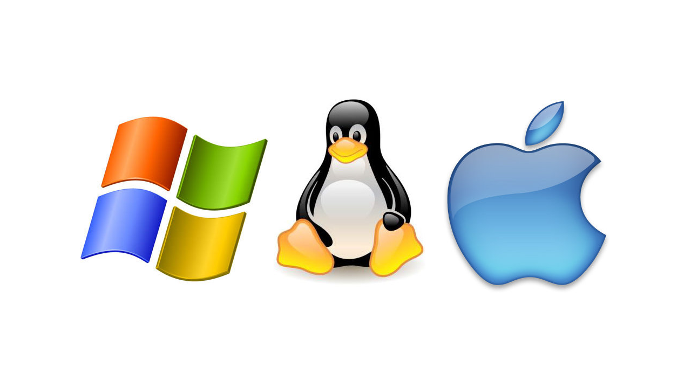
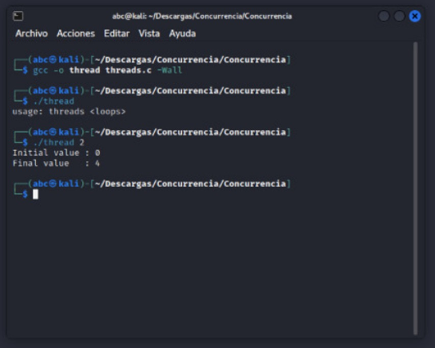

# Proyecto Final - Sistemas Operativos

**Juvey Valadez Miramontes - 12443**
**Proyecto Final Sistemas Operativos**

#### ¿Qué hace un sistema operativo?
Es uno o varios programas que se usan para poder trabajar en los componentes de un equipo de computadora o dispositivo electrónico.
Existen varios tipos de Sistemas Operavios pero los mas importantes son los siguientes.
- Windows
- Mac Os
- Linux



Cabe mencionar que los Sistemas Operativos no simplemente son para las computadoras, también estan para los celulares, aquí estan algunos de los Sistemas Operativos del celular.
- iOs
- Android


Tambien los Sistemas Operativos son los encargados de la Ejecución de Programas. Por ejemplo:
- Iniciar una aplicación
- Ejecutar un comando
- Abrir una carpeta
- Abrir una página de internet


#### ¿Qué es el Open Source?
Es un codigo abierto, a esto se refiere que cualquier persona tiene acceso a el, asi como otros derechos de estos, un ejemplo de esto seria el sistema operativo Linux, que tiene un codigo gratiuto por eso el sistema operativo es gratis.


#### Historia de los sistemas operativos Mac OS, Ubuntu y Windows
La historia de los Sistemas Operativos el algo interesante ya que se dividieron en 5 niveles dependiendo de que tan avanzados eran, a continuación te mostrare los niveles de los sistemas operativos en general.

| *Primer Nivel* |
- Sistemas operativos básicos.
- Surgen en los años cincuenta del siglo XX.
- Lenguaje de programación: FORTRAN.
- Se programaba en tarjetas perforadas.

| *Segundo Nivel* |
- Aparece en los años sesenta del siglo XX.
- Aumenta el rendimiento de utilización del procesador.
- Aparecen los procesos on-line (conectado directamente a la computadora) y off-line (conexión a través de otros dispositivos más rápidos).
- Aparecen las técnicas de buffering y spooling. El buffering es cuando se almacenan los datos en memorias intermedias o buffer. El spooling es cuando se almacenan los datos en discos magnéticos.

| *Tercer Nivel* |
- Aparece en los años setenta del siglo XX.
- Aparece la multiprogramación: ejecución de varios programas en un mismo procesador.

| *Cuarto Nivel* |
- Aparece en los años ochenta del siglo XX.
- Se mejora la seguridad a través de la conexión en paralelo de varias computadoras, que comparten memoria, buses y terminales.
- La velocidad de los procesos aumenta con el uso de multiproceso: computadoras que tienen más de un procesador.

| *Quinto Nivel* |
- Sistemas operativos para sistemas móviles.

##### Historia del Sistema Operativo Mac Os
*1984 - Sistema 1*

El Sistema 1 tenía escritorio, ventanas, iconos, mouse, menús y scrollbars.
El basurero “Trash” funcionaba como un tobogán de basura, todo desaparecía luego de reiniciar el ordenador.


*1985: Sistema 2*

El Sistema 2 fue notable en mejoras. Incrementó la velocidad del Finder haciéndolo un veinte por ciento más rápido, los comandos de regresar y cerrar se eliminaros.

*1986: Sistema 3*

En el Sistema 3 el Finder fue mejorado y más rápido. Los folders eran reales y se podían crear folders dentro de folders.
Haciendo clic nuevamente se podía hacer que la ventana regresara a su tamaño normal. El icono del basurero sobresalía cuando algo era puesto sobre este y las líneas punteadas en dirección contraria.

*1987: Sistema 4*

El Sistema 4 fue introducido como Macintosh SE y Macintosh II. A este sistema se le agregó múltiple soporte al monitor.
Soportaba discos de 32+ MB, se le implemento el Finder múltiple, los usuarios podían cambiar entre el Finder, que solo soportaba un programa y el Finder múltiple que soportaba múltiples programas al mismo tiempo.

*1988: Sistema 6*

En el Sistema 6 se agregaron colores, aun así el Finder no tenía color, aunque las máquinas ya eran capaces. A la opción de “Borrar Disco” se le agrego un botón para poder cancelar esta acción.


*1990: Sistema 7*

El Sistema 7 fue el gran cambio de software para esta época, se eliminó el Finder y el Finder múltiple. El Sistema 7 ya sólo tenía el Finder múltiple permitiendo hacer muchas tareas simultáneamente. Mac OS 7.6, fue el primer sistema operativo lanzado con una estrategia de Apple para luego ser actualizado como el actual Mac OS cada 6 meses.

*1997: Mac OS 8*

Mac OS 8 incluyó otra renovación al Finder que podía hacer más cosas al mismo tiempo, dando la opción de controlar múltiples aplicaciones al mismo tiempo con un mejor desempeño de las computadoras con procesador.

*1999: Mac OS 9*

La opción de tener varios usuarios en una Mac fue agregada en esta versión, permitía a los usuarios ingresar y tener sus propias configuraciones.

*2001: Mac OS X 10.0 “Cheetah”*

Mac OS X 10.0 contenía todas características de un sistema operativo moderno, protegía la memoria, y así los programas no podían utilizar la información de otros programas, de esta forma el procesador no se bloqueaba, los drivers de los dispositivos podían ser cargados o descargados si eran necesario.


*2001: Mac OS X 10.1 “Puma”*

Incorporaba mejor desempeño. La mayoría de open source como utilidades de UNIX fueron incluidas en las Mac OS X y drivers adicionales para poder soportar mas dispositivos.

*2002: Mac OS X 10.2 “Jaguar”*

Contaba con un nuevo incremento en su rendimiento, un nuevo y depurado look y más de 150 mejoras, entre estas estaba el mayor soporte para redes de Microsoft Windows, Quartz Extreme para la composición de gráficos sea procesada directamente por la tarjeta de video y un filtro contra spam.

*2003: Mac OS X 10.3 “Panther”*

Además de tener un rendimiento mucho mayor, incorporó la mayor actualización en la interfaz de usuario, y muchas mejoras que Jaguar el año anterior.

*2005: Mac OS X 10.4 “Tiger”*

Fue la versión disponible más reciente, contenía más de 200 nuevas mejoras, pero como sucedió con el lanzamiento de Panther, algunas máquinas antiguas no podían soportarlo.

*2006: Mac OS X 10.5 “Leopard”*

Esta versión es compatible con las PowerPC y con la nueva tecnología Intel.

*2009: Mac OS X 10.6 “Snow Leopard”*

La más reciente versión del sistema operativo de Mac, apodado Snow Leopard, fue lanzado el 28 de agosto de 2009 y es más rápido que sus predecesores.

##### Historia del Sistema Operativo Windows

*Windows 1.X/ 2.x.*

Significó un gran cambio para los sistemas operativos de la época que se basaban en representaciones de textos. Esta versión empleó representaciones gráficas de tipo monocromáticas.


*Windows 3.x.*

Se lanzó como una interfaz multitareas y netamente a color que contenía nuevos conceptos informáticos, como íconos, carpetas, barra de tareas y papel tapiz, entre otros.

*Windows NT.*

Se lanzó como una versión diferente diseñada para su conectividad a servidores de una red. Compitió con el sistema operativo UNIX.

*Windows 95.*

Fue una versión completamente mejorada con una gestión de entornos de 32 bits y la función plug and play que permitía conectar y ejecutar un dispositivo al ordenador sin tener que realizar una configuración previa.


*Windows 98/ 98 SE.*

Fue una versión muy similar a su antecesora, pero que ofreció una mejoría para el reconocimiento de más variedad de dispositivos externos mediante la función plug and play.

*Windows 2000.*

Fue una evolución de la versión Windows con la mejora en el reconocimiento del hardware, del soporte de 64 bits y del servicio de Active Directory (Directorio activo), que permitía compartir dispositivos en red, como una impresora, un router o un servidor con otros ordenadores que también estaban conectados a la red.

*Windows Millenium.*

Fue una versión similar a su antecesora, pero con la importante mejoría de un amplio reconocimiento de los dispositivos externos, a través de la renovada función plug and play a través de las entradas de puerto USB.

*Windows XP.*

Fue una versión destacada por la posibilidad de ejecutar la asistencia remota, es decir, le permitía al usuario compartir el control de su equipo con otro ordenador que se encontrara conectado a una red interna o externa.


*Windows 7.*

Se lanzó como una versión ampliamente mejorada en cuanto a la compatibilidad, tanto de programas como de conectores externos, incluso, para trabajar con varios monitores en simultáneo. Ofreció, además, mayor velocidad de procesamiento de datos que permitió una rápida transición de gráficos.

*Windows 10.*

Consistió en una nueva generación del sistema operativo con un formato de pizarra interactiva propio de la telefonía celular. Además, su renovada interfaz ofrecía mejores prestaciones para trabajar conectados a las nubes o servidores externos.


##### Historia del Sistema Operativo Linux
Cada distribución, desde Debian hasta Ubuntu, cuenta con el respaldo de sus respectivas comunidades. Voluntarios comprometidos con el desarrollo de software libre que programan los paquetes de datos y refuerzan las defensas de sus distribuciones, mejorando cada vez más para los usuarios.

*1993*

Se inició proyecto GNU, fundado por Richard Stallman, quien tenía como objetivo crear un sistema operativo similar a UNIX. La Fundación de Software Libre (FSF por sus siglas en inglés) se creó en el año 1985, y fue desarrollada la Licencia pública general de GNU, o GNU GPL.

*1991 a 1999*

En el año de 1991, un estudiante de ingeniería informática llamado Linus Tovalds desarrolló un emulador de terminal que podía utilizar de forma independiente de un sistema operativo. Al poco tiempo, Tovalds se dio cuenta de que había diseñado el núcleo de un sistema operativo funcional


#### Comandos básicos de la terminal Unix (terminal de Mac o Ubuntu)
```sh
cd - Cambiar el directorio.
```
```sh
cd newFolder - Sirve para crear un nuevo directorio en la ruta actual.
```
```sh
history - Muestra el historial de comandos.
```
```sh
rm fileName -Elimina un archivo con el nombre indicado
```
```sh
vim fileName - Abre un archivo con el editor vim.
```
```sh
ls - Muestra los archivos que se encuentran en esa ruta / comando para enlistar todos los archivos o directorios dentro del directorio actual.
```
```sh
touch fileName - Crea un archivo con el nombre que se le indica.
```
```sh
ls -la - Agrega informacion extra e incluye los archivos ocultos.
```
```sh
make directoyName - Sirve para crear un directorio con el nombre que se le especifica.
```
```sh
git init - Inicializa un repositorio de git.
```
```sh
git add . - Agrega todos los cambios nuevos que estan en nuestra maquina local.
```
```sh
git commit -m “mensaje” - Guarda un cambio de nuestro repositorio para subirlo a la nube.
```
```sh
git push - Sube los cambios a nuestro cliente remoto por ejemplo github.
```

#### Dispositivos de Entrada/Salida
Las operaciones de Entrada/Salida son el conjunto de acciones necesarias para la transferencia de un conjunto de datos.

| **Dispositivos de Entrada** |

Son aquellos equipos encargados de introducir datos en la memoria central de la computadora para su tratamiento.


| **Dispositivos de Salida** |

Son los equipos que presentan la información al usuario de forma comprensible, ya sea a través de imágenes, texto, sonido o táctil.


| **Dispositivos Mixtos** |

Permiten la introducción y extracción de datos en la memoria central.


#### Procesos, ejemplo de algún algoritmo de planeación
##### *¿Qué es un proceso?*
Es el nombre que se le da a la ejecución de un programa individual, representado por una serie de instrucciones que el procesador debe ejecutar.

##### *Estados de un Proceso*
**Nuevo** - Se solicitó al sistema operativo la creación de un proceso.


**Listo** - Está listo para iniciar o continuar su ejecución, pero el sistema no le ha asignado un
procesador.


**En Ejecución** - El proceso está siendo ejecutado en este momento.


**Bloqueado** - En espera de algún evento para poder continuar su ejecución.


**Zombie** - El proceso ha finalizado su ejecución, pero el sistema operativo debe realizar ciertas operaciones de limpieza para poder eliminarlo de la lista.


**Terminado** - El proceso terminó de ejecutarse; sus estructuras están a la espera de ser limpiadas por el sistema operativo.


Un claro ejemplo de como se implementa esto es a la hora de inicializar un juego por ejemplo, cuando clickeas en el ícono del juego y empieza su ejecución, el sistema operativo en este momento empieza a generar un proceso a eso, una vez terminado eso el sistema operativo va a dedicarle un procesador, y comienza su ejecución, sin embargo, el juego se puede bloquear si hay algun otro programa ejecutandose y este afectando su rendimiento. Una vez terminado cuando se cierrre el juego entrara en modo Zombie, esto puede pasar porque tal vez el juego requiera una copia de guardado. Por último, el proceso se termina cuando ya se limpio y no queda rastro alguno de ello.

#### Almacenamiento
Es un conjunto de componentes electrónicos habilitados para leer o grabar datos en el soporte de almacenamiento de datos de forma temporal o permanente.

Se clasifican dependiendo de su peso, en este caso la unidad minima o básica es el bit y se representa por la letra b, simplemente es un 0 o 1, luego seguiria el Byte (B) es la primera unidad de almacenamiento que tiene sentido, esta compuesta por 8 bits, luego El Kilobyte(KB) equivale a 1024 Bytes, el Megabyte(MB) equivale a 1024 KB, el Gigabyte(GB) equivale a 1024 MB, el Terabyte(TB) equivale a 1024 GB.


#### Jerarquía de la Memoria
Todo el mundo quiere tener una Memoria muy rapida y eficiente pero hay algo que nos limita a tomar esta decisión y es el costo. Si una memoria es muy rapida, tendra un precio muy elevada y sera pequeña, mientras que una memoria un poco mas lenta sera barata y grande.

SRAM - Es una memoria volatil lo que quiere decir que si el dispositivo es apagado los datos se perderan.


SDRAM - Se utiliza para implementar la memoria principal.


#### Ejemplos de Virtualización del CPU, Virtualización de Memoria, Concurrencia, Persistencia 
##### Virtualización del GPU
Es una característica del hardware que permite a un único procesador actuar como si fueran varios procesadores individuales.


##### Virtualización de Memoria
Utiliza la funcionalidad de hardware para generar las asignaciones combinadas con las tablas de páginas del invitado y las tablas de páginas anidadas que mantiene el hipervisor.


##### Concurrencia
Dos o más procesos decimos que son concurrentes, paralelos, o que se ejecutan concurrentemente, cuando son procesados al mismo tiempo.



##### Persistencia
Es la representación residual de datos que han sido de alguna manera nominalmente borrados o eliminados.


#### Personajes importantes para los sistemas operativos como Linus Torvalds y Denis Ritchie.
##### **Linus Torvalds**
 Ingeniero de software finlandés-estadounidense, ​ conocido por iniciar y mantener el desarrollo del kernel Linux. A su vez creo Kernelque básicamente en el sistema operativo se encarga de conceder acceso al hardware de forma segura. También Git que es un repositorio de control de versiones.
 
 
 
##### **Dennis Ritchie**
  El creador del lenguaje de programación C y coautor, junto con Ken Thompson, del sistema operativo UNIX. Tuvo una gran influencia en otros lenguajes de programación, estableciendo conceptor y principios que hoy en dia son muy utilizados.
  
  
  
##### **Richard Stallman**
Es el padre del proyecto GNU, en el que se engloba el primer sistema operativo libre, que vio la luz en 1983. Desde los años noventa funciona con otro componente, Kernel Linux, por lo que se rebautizó como GNU-Linux.


##### **Bill Gates**
Cofundador de la empresa de software Microsoft, productora del sistema operativo para computadoras personales más utilizado en el mundo, Microsoft Windows.


##### **Steve Jobs**
Cofundador de Apple, donde se enceuntra uno de los sistemas operativos mas usados del mundo Mac Os.


#### Instrucciones para instalar Linux

##### Primer Paso
Tendremos que ir a la página de ubuntu y descargar el ISO.


##### Segundo Paso
Tendremos que tener una memoria USB de preferencia unos 8 gb, en ella tendremos que formatearla, para ello utilizaremos un programa llamado "Rufus", en el cual seleccionaremos nuestri dispositivo USB y cargaremos el ISO, para posteriormente clickear en Listo.


##### Tercer Paso
Una vez que tengamos nuestra USB, tendremos que reinciar nuestra computadora y entrar a la BIOS para poder cambiar nuestra forma de arranque y ponerle que lo inicie desde la USB.


##### Cuarto Paso
Una vez entremos, la computadora solita nos metera al instalador de Ubuntu, en el cual tendremos que elegir el idioma, clicker Instalar Ubuntu y el método de instalación. A su vez nos dira si queremos borrar el disco actual e instalar Ubuntu o si queremos dedicarle un espacio en la memoria, ESTO ES DECICIÓN DE CADA UNO.


##### Quinto Paso
Una vez hecho todo lo anterior solo nos queda darle click a Instalar Ahora y listo!, tendremos ya nuesto Ubuntu listo para todo.


